The first part of the blog post can be found [here](http://dstil.ghost.io/scaling-with-aws-1). Alternatively you can continue reading below.

# Scaling your services with AWS: Part 1

If you’ve ever developed something and put it online, you’ve probably thought about scaling at some point. In this blog series we’ll explore scaling in AWS using EC2 instances (virtual machines).

This is the first part of the series, and in this blog we’ll define scaling, and set up a simple demo system using Amazon Web Services (AWS) with all infrastructure needed to get scaling started. Later in this series we’ll build upon this blog and introduce automated scaling.

## So, what is scaling?

Scaling is the process where a system is able to cope with increases or decreases in demand through the introduction or removal of resources. The added or removed resources depend on the type of scaling that’s performed.

There are two types of scaling, you can scale up and down, or scale in and out. Scaling up and down is where a server is made to be more powerful or less powerful through the addition or removal of processors, memory, and/or disc space. Scaling in and out is where additional servers are added or removed.

In this multi-part series we will discuss the latter: scaling in and out. I won’t touch on scaling up and down beyond this point.

## But will my software / service scale?

Scaling in and out is achievable fairly easily, as long as your software doesn’t store persistent state internally (instead relying on external storage like a database sitting on a separate server). If you store state in memory, you’ll need to change your software to use external storage outside of the EC2 instance.

You’re probably wondering why you need to store state externally to your application, the reason is we’ll be using load balancers which direct traffic to any available server, meaning you can’t assume that a client will reach the same server each time.

_But my software stores state in memory, can I still scale?_ Short answer is yes, and you’ll need to use a different type of load balancer that will always direct user traffic to the same server each time, but we won’t discuss that type of scaling in this series.

## I’m ready to scale, tell me more!

In order to scale your software in and out on AWS, there are a few things you’ll need to know.

*[EC2 instances](https://aws.amazon.com/ec2/details/) (Elastic Compute Cloud instances)*
When we scale in and out, we’ll be adding and removing virtual machines. On AWS a virtual machine is called an Elastic Compute Cloud instance, or EC2 instance for short.

*[Launch Configuration](http://docs.aws.amazon.com/autoscaling/latest/userguide/LaunchConfiguration.html)*
We can create EC2 instances manually, but then it wouldn’t be much of an automated process. In order to automate the creation of EC2 instances we’ll need Launch Configurations. A Launch Configuration is simply a blueprint that specifies the [type of instance](https://aws.amazon.com/ec2/instance-types/) you want, the operating system you want to use (known as an [Amazon Machine Image](http://docs.aws.amazon.com/AWSEC2/latest/UserGuide/AMIs.html) or AMI for short), and a few other details.

*[Auto Scaling Groups](http://docs.aws.amazon.com/autoscaling/latest/userguide/AutoScalingGroup.html)*
But Launch Configurations by themselves can’t create EC2 instances for us, we will need to use Auto Scaling Groups (ASG) to create them for us. The only thing an ASG needs is a Launch Configuration.

It’s almost as simple as that, though there’s a bit more to it. ASGs also store additional information, such as minimum, maximum, and desired number of EC2 instances. ASGs also use a bunch of rules to adjust the desired number of EC2 instances - that's how scaling occurs without manual intervention.

These rules can monitor data from CloudWatch. *[CloudWatch](https://aws.amazon.com/cloudwatch/details/)* is a service which stores metrics like CPU and memory usage and also accepts custom metrics that you publish to it.

To summarise, our system will scale in and out by using ASGs. Our ASG needs a Launch Configuration, which will provide the specifications for creating EC2 instances. Our ASG will also apply some rules, using CloudWatch metric data, to decrement or increment the desired number of EC2 instances.

Okay that sounds a bit daunting, but let’s get the ball rolling and start off small by creating something simple: a basic ASG with a Launch Configuration, no rules, or automated scaling.

## Demo: Hello ASG World!

In order to simplify things throughout this multi-part series we will use [CloudFormation](https://aws.amazon.com/cloudformation/) to create AWS infrastructure for us. If you’ve never used it before, don’t worry—all CloudFormation does is accepts a script which defines the infrastructure to be created, and it goes ahead and creates that infrastructure. I’ve also got you covered with a script I prepared earlier.

Before we get stuck into it, I need to let you know that working through these demos requires an AWS account. AWS resources such as EC2 instances have a cost associated with them. These demos will try to make use of as many [free tier](https://aws.amazon.com/free/) AWS services as possible, but you may find yourself with a bill at the end of the month.

To minimise costs as much as possible, it’s recommend that you terminate any infrastructure created by this demo as soon as you are finished working with it. Using CloudFormation terminating everything is simple and we’ll guide you through that step too.

Lastly, I highly recommend that you create yourself an AWS account rather than using,  for example, your work account—especially if you’re new to AWS. Using a personal account means there is an air gap between you and any workplace systems. This blog series will assume that you’re working from a personal AWS account.

**Step 1: Generate SSH Key**

First, before we do anything, you’ll need to login to your AWS Web Console and generate a Key Pair which is used to SSH into EC2 instances; we won’t be actively using it until future parts of this blog series, but just in case you want to SSH into your EC2 instance and poke around we’ll do it now.

Once you’ve logged into the AWS web console, find the EC2 section. If you’re having some trouble, click on the drop down in the top left called “Services” and then find “EC2” under “Compute”.

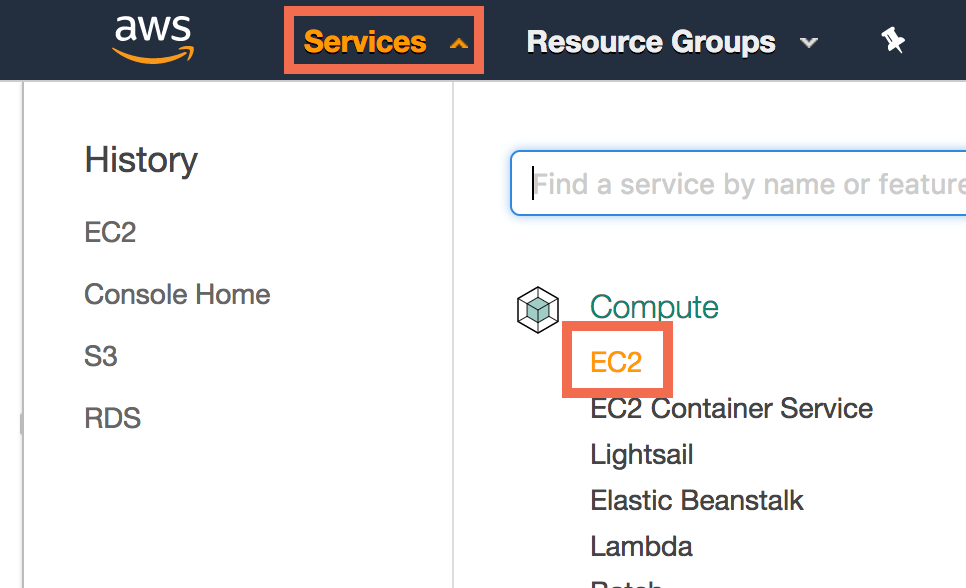 EC2" style="width: 400px;display: block; margin: auto;"/>

From the EC2 Dashboard there should be a menu down the left hand side, click on “Key Pairs” under “Network & Security”.

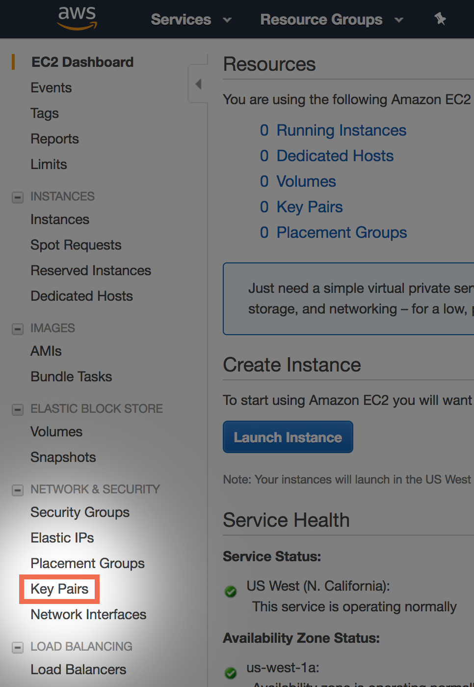

Once you are on the “Key Pairs” page click on the “Create Key Pair” button and give your key pair a name. When naming your Key Pair, we recommend using [snake case](https://en.wikipedia.org/wiki/Snake_case). If you’re struggling to name your key call it `scaling_demo`.

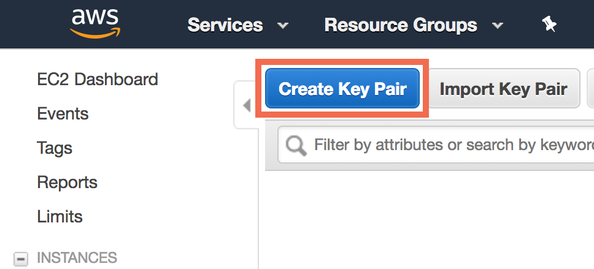

You should find a “.pem” file starts downloading the moment you’re done. This “.pem” file is needed to SSH into EC2 instances in later parts of this series.

Remember the name of your key pair as you will need it shortly. Keep this “.pem” file in a safe place, do not misplace it as you cannot download it again.

Additional key pairs can be created repeating the process above. Do not forget to delete keys you are no longer using. You may wish to delete the key pair you just created at the end of this demo—just keep in mind in future parts of this series you’ll need to create a new key pair.

If you misplace your “.pem” file or you have shared it with someone else accidentally or you believe it to be compromised, delete the entry from AWS immediately as well as the “.pem” file from your computer—you can always create a new pair to use in the future.

One last recommendation, across this blog series you can reuse the same key pair to SSH into EC2 instances—however in a production environment we recommend each EC2 instance or ASG has a different key, this way if one key is compromised only a small part of the system can be directly SSH’d into. Lastly you should definitely use different keys across different projects in a production environment.

**Step 2: CloudFormation**

Find the CloudFormation section of the AWS web console. You can find it under the “Management Tool” section of the “Services” drop down menu in the top left corner.

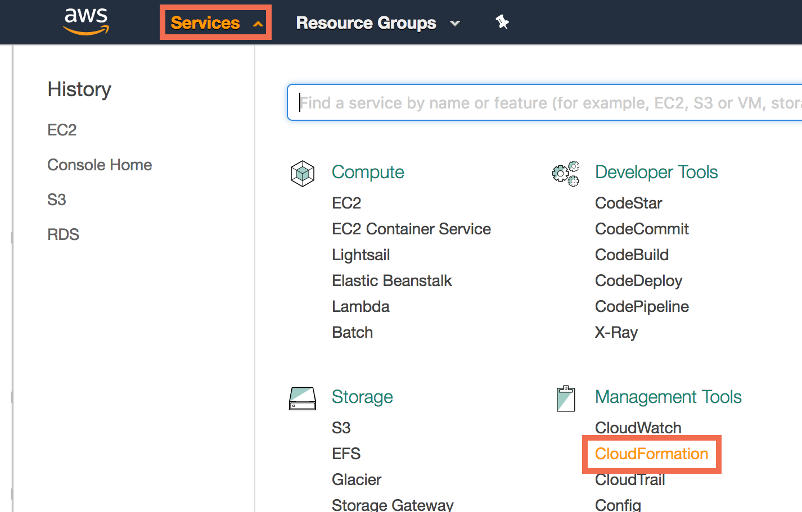 CloudFormation" style="width: 400px;display: block; margin: auto;"/>

Once there, you should be able to create a new stack by clicking the “Create Stack” button.

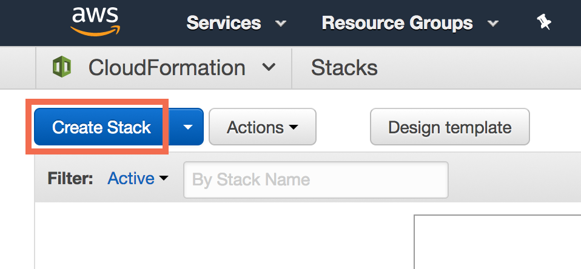

You’ll now be asked to select a template, [I've got one for you](./cloudformation-script.yml). Download the contents of that file, and then using the “Upload a template to Amazon S3” option, press the “Choose file” button and select the file on your computer and upload it. Press next.

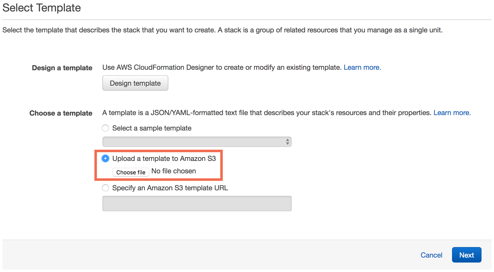

You’ll now be asked to give the stack a name, you can name it whatever you like! If you’re struggling to come up with something, just call it “scaling-demo-part-1”. You’ll also be asked to specify a “KeyPairName”, please enter the name of the Key Pair you created in the first step. Press next.

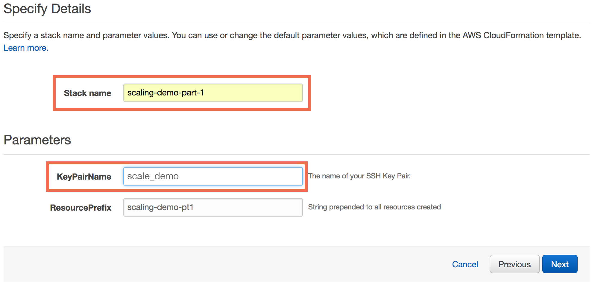

On the next screen you do not need to change any options. Press next. You’ll find yourself on the review screen, where you can review details about the CloudFormation stack and even see a cost estimation. Once you’re ready press “Create”.

You should be taken to CloudFormation Stacks page, which’ll show you a list of all CloudFormation stacks and you should see our stack being created; it’ll have the same name as you entered in earlier, and you should see its status as `CREATE_IN_PROGRESS`.

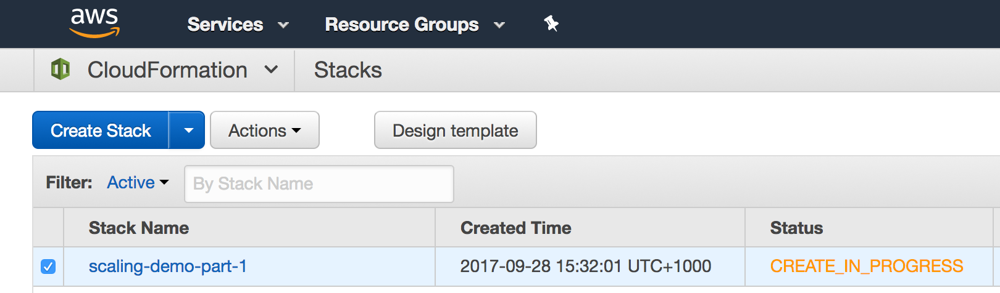

If you click on its row, you can then use the tabs in the lower part of the screen to get an overview of the stack, see the resources that are to be created, the CloudFormation events, and other details.

Once you see the status change to `CREATE_COMPLETE` this means that the resources have been created and you can now move on to the next step.

**Step 3: Poking around the ASG / EC2 instance**

If you go back to the EC2 section of the AWS web console, and then click on “Instances” in the menu on the left, you should be presented with a screen that lists all the EC2 instances we have. You should see an EC2 instance with the name: “scaling-demo-pt1-auto-scaling-group”.

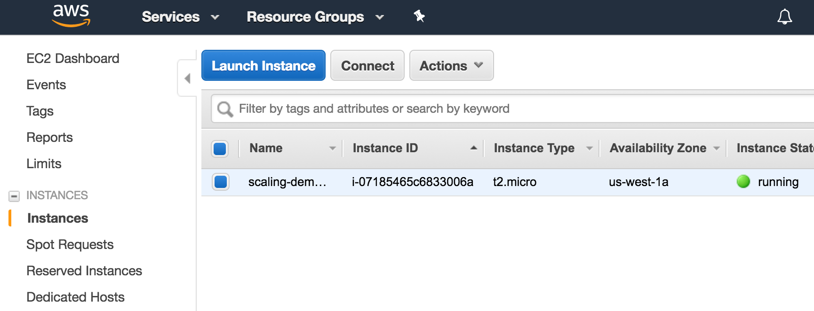

If you head over to the “Auto Scaling Group” section found in the menu on the left and click on the hyperlink titled “Auto Scaling Group: X” (where “X” is the number of ASG’s you have) you should see an ASG named “scaling-demo-part-1-AutoScalingGroup-XXXXXXXXX” (where the X’s are a unique ID).

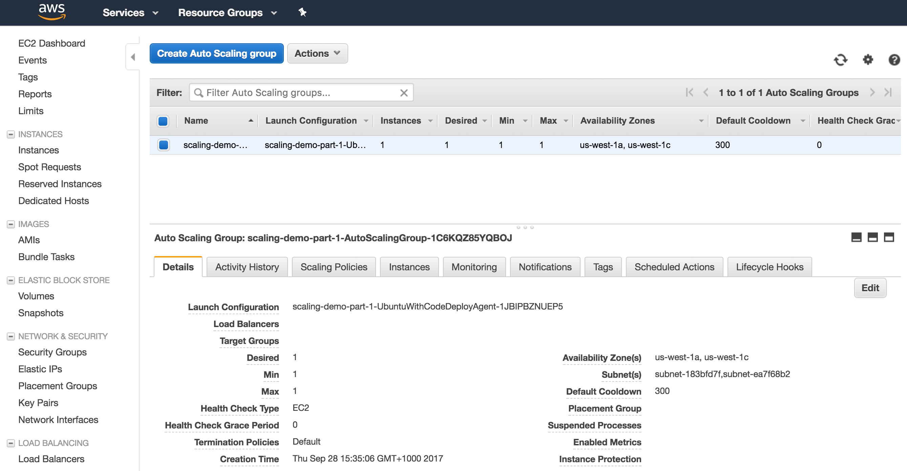

If you click on our ASGs row and look to the bottom of the page you should see a tab named “Details”, which contains information about the group including the the maximum number, the minimum number, and desired number of instances. You can press the “Edit” button and adjust those values, and instances will either be created or destroyed depending on what you do. You can take a look at the results of your actions in the “Instances” section like we did at the start of this step - do note that at times AWS may take a minute or two to respond to a change made to ASGs.

To summarise what we’ve done: we’ve used CloudFormation to create a stack which I prepared earlier. That stack contains a few things—including a Launch Configuration and an Auto Scaling Group. The ASG cannot scale automatically just yet, but we can manually adjust the number of desired EC2 instances and the ASG will create or destroy EC2 instances for us to achieve that desired count. 

Let’s move on to cleaning up so that we don’t rack up a bill!

**Step 4: Cleaning up**

Cleaning up is fairly simple; all you need to do is go back to the CloudFormation section of the AWS web console,select our stack, and then delete it using the “Actions” drop down menu, followed by selecting “Delete Stack”. A dialog will appear asking you to confirm your actions.

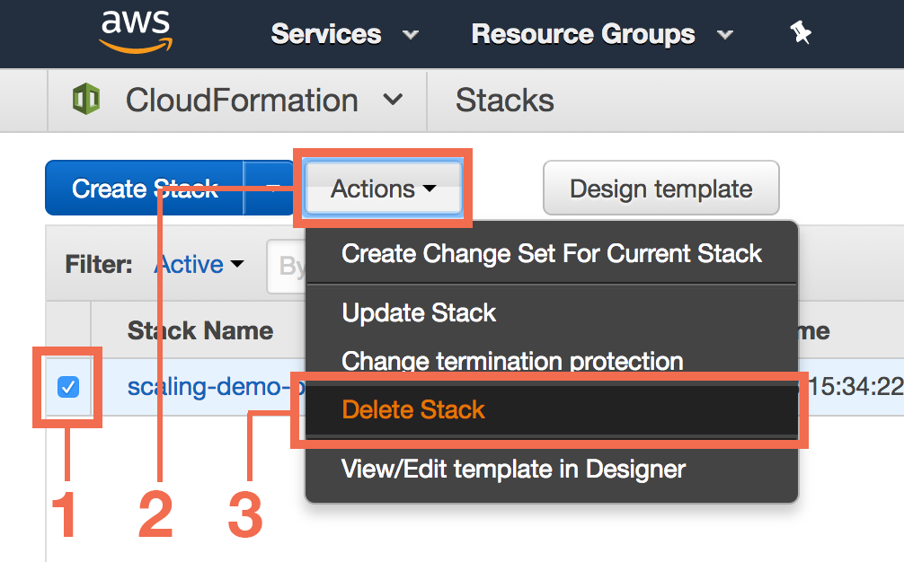

Lastly, CloudFormation stores the script we uploaded on S3. S3 is an AWS service, and it stands for Simple Storage Service. S3 offers the ability to store files and folders in “Buckets” (just think of “Buckets” as folders). In order to be thorough we should also delete the script CloudFormation stored in S3 for us. Head over to the S3 web management console (accessible from the “Services” drop down menu in the top left corner).

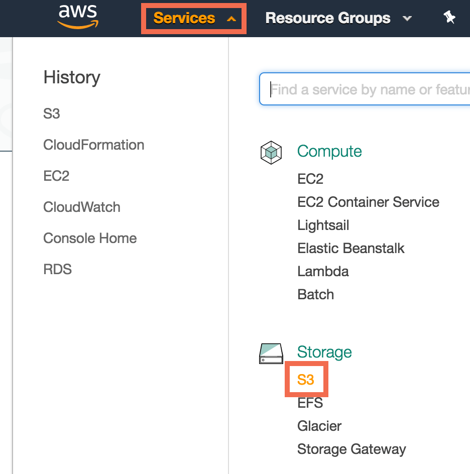 S3" style="width: 400px;display: block; margin: auto;"/>

Once you’re there, find an S3 bucket named “cf-templates-XXXXXXXXXXX-location” where the Xs represent a unique string of characters and “location” is the region the CloudFormation stack was created from.

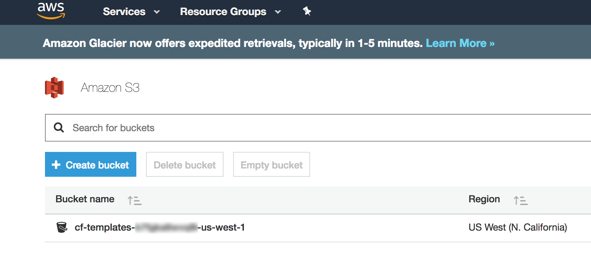

If all has gone smoothly you should see one file with the extension “.yml”; simply select it, click on “More”, and then “Delete”. If you see more than one file, it might be because CloudFormation failed one or more times, so you retried the script, or maybe you’re using CloudFormation for something other than this demo. In either case, be sure to review the files carefully to make sure they were part of this demo before you delete them.

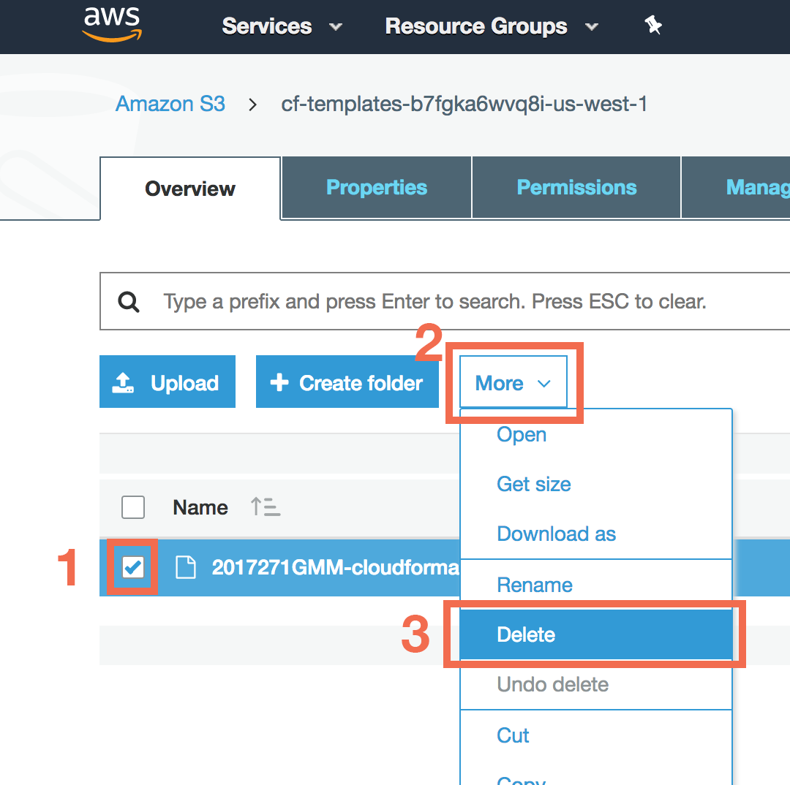

If there’s nothing left in that S3 bucket, and you’re feeling particularly thorough, you can also delete the bucket too. Lastly, if you’re still feeling thorough, you may also wish to delete the “.pem” file from your computer as well as from AWS. Note that in the next part of this series we will need a Key Pair as well so you may want to keep it and re-use it, otherwise you can always make a new Key Pair later.

**Step 5: Pat yourself on the back**

And we’re done! At least we are for now. Stay tuned for the next part of the series where we’ll build upon this demo to create a stack that scales in and out automatically.

Thanks to Allan Jones and David Willie for reviewing this post.

Header image courtesy of [Maria Molinero](https://unsplash.com/photos/8z8lEG_N_q4), utilised pursuant to Creative Commons Zero licence.
